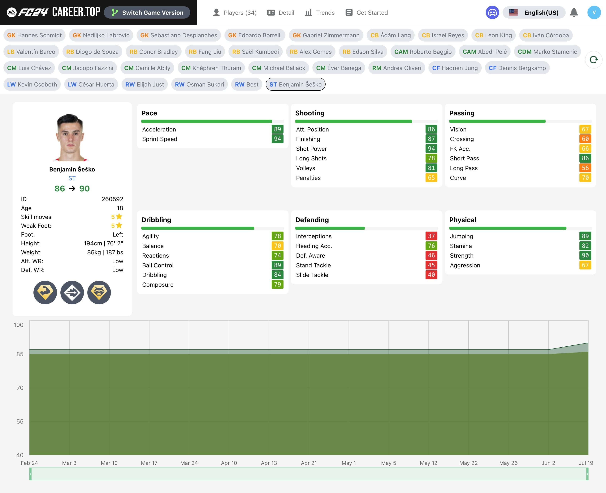
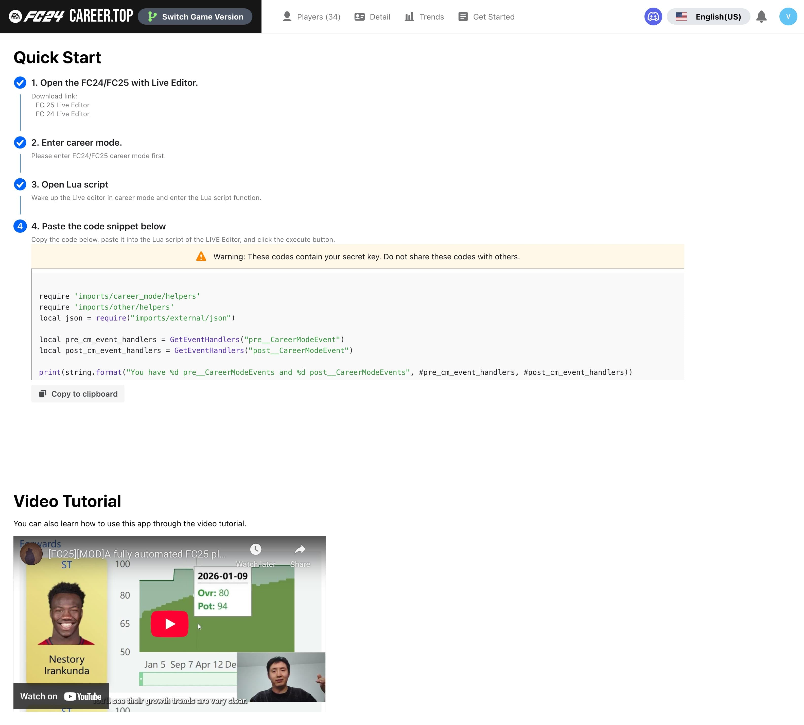

# FC Career Top

[English](README.md) · [简体中文](README.zh-CN.md) · [Documentation](docs/README.md)

Track your squad's development across seasons in **EA FC 24–27 Manager Career Mode**.
FC Career Top uses Live Editor Lua scripts to collect player data automatically,
then turns those snapshots into player lists, growth charts, detailed attributes,
and change notifications.

**Try it:** [Player dashboard](https://app.fccareer.top) · [Website](https://www.fccareer.top).
You can also run locally or deploy your own instance on Cloudflare Free.

## Features

- **Automatic tracking:** collect a snapshot when the script starts and after each in-game week.
- **Squad overview:** search and sort players by age, position, overall rating, and potential.
- **Growth charts:** follow overall rating and potential across in-game dates.
- **Player details:** view attributes, skill moves, weak foot, and available PlayStyles.
- **Position leaders:** highlight the top three players by overall rating or potential at each position.
- **Change notifications:** receive overall/potential, skill-move, and weak-foot updates.
- **Game selection:** switch between FC 24 and FC 25 data.
- **Five interface languages:** English, Simplified Chinese, French, German, and Japanese.

The game integration requires a **Windows PC** and a compatible
[FC 24](https://github.com/xAranaktu/FC-24-Live-Editor),
[FC 25](https://github.com/xAranaktu/FC-25-Live-Editor),
[FC 26](https://github.com/xAranaktu/FC-26-Live-Editor) or
[FC 27 Live Editor](https://github.com/xAranaktu/FC-27-Live-Editor).
See the [player guide](docs/USER_GUIDE.md) for the full setup and current limitations.

## Screenshots

These application captures were taken on March 26, 2025.

**Player list**


**Player growth trends**


<details>
<summary>Player details and game setup</summary>

**Player details**



**Get Started**



</details>

## Quick start: run locally

You need **Node.js 24.21.0** and **pnpm 10.5.0**. Cloudflare Wrangler runs
D1 and Durable Objects locally; no MySQL, Docker, or email service is required.
See the [development guide](docs/DEVELOPMENT.md) for configuration.

```sh
git clone https://github.com/VeejaLiu/FC-Career-Top.git
cd FC-Career-Top
corepack enable
pnpm install --frozen-lockfile
cp apps/backend/.dev.vars.example apps/backend/.dev.vars
```

```sh
pnpm db:migrate
pnpm dev
```

| Application | Local address |
| --- | --- |
| Player dashboard | http://localhost:3000 |
| Public website | http://localhost:3002 |
| Backend health check | http://localhost:8888/api/health_check |

Open the dashboard and register with an email and password. Sign in with email and
password; email verification is disabled.
Select your game version, then copy the account-specific Lua script from
**Get Started** and run it in Live Editor. The [player guide](docs/USER_GUIDE.md)
walks through these steps.

## Documentation

| Guide | What it covers |
| --- | --- |
| [Player guide](docs/USER_GUIDE.md) | Live Editor setup, tracking, notifications, and troubleshooting |
| [Development](docs/DEVELOPMENT.md) | Install, environment variables, commands, and project architecture |
| [Database migrations](docs/DATABASE.md) | D1 setup and adding versioned SQL migrations |
| [Deployment](docs/DEPLOYMENT.md) | Build outputs and configuration for a first deployment |
| [Application guides](docs/README.md#application-guides) | Frontend, website, and backend responsibilities |

## Repository structure

```text
apps/
  frontend/     React 18 player dashboard
  website/      Next.js 15 / React 19 public website
  backend/      Cloudflare Worker API, D1 migrations, and Durable Objects
docs/           Shared guides, screenshots, and historical material
scripts/        Workspace helpers
```

The three applications share one pnpm workspace and lockfile. Their original
default-branch histories are preserved; see the [consolidation record](docs/archive/MONOREPO.md).

## Contributing and support

Report bugs and suggest improvements through [GitHub Issues](https://github.com/VeejaLiu/FC-Career-Top/issues).
For development work, follow the setup and checks in the [development guide](docs/DEVELOPMENT.md#contributing).

## License

The backend's existing license is at [apps/backend/LICENSE](apps/backend/LICENSE).
No repository-wide license has been added for the other applications.
