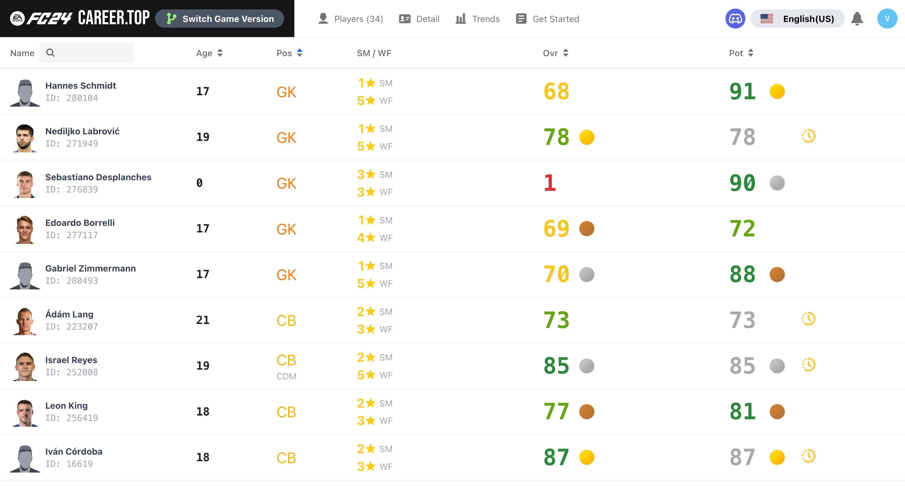
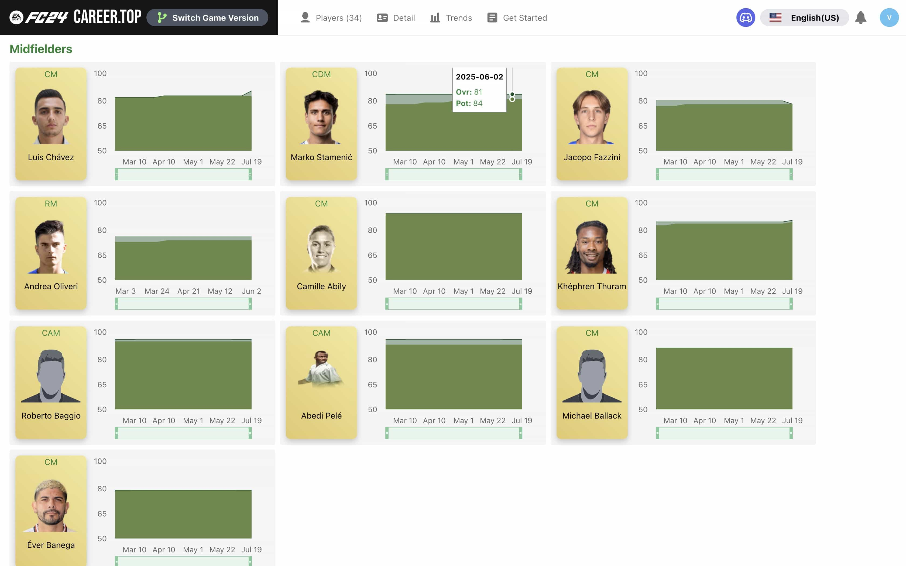

# FC Career Top

[English](README.md) · [简体中文](README.zh-CN.md) · [文档目录](docs/README.md)

自动记录 **EA FC 24–27 经理生涯模式**中的球员成长。
通过 Live Editor 的 Lua 脚本采集球队数据，在网页中查看球员列表、成长曲线、
详细属性，以及能力值、潜力、花式动作和逆足变化通知。

**在线体验：** [球员管理界面](https://app.fccareer.top) · [项目官网](https://www.fccareer.top)。
也可以在本地运行，或使用 Cloudflare 免费套餐自行部署。

## 主要功能

- 脚本启动时采集一次，此后每个游戏内周自动记录球队数据。
- 查看、搜索和排序球员的年龄、位置、能力值和潜力。
- 查看能力值与潜力随游戏日期变化的曲线。
- 查看球员详细属性、花式动作、逆足和可用的 PlayStyles。
- 标记同一位置中能力值或潜力排名前三的球员。
- 接收能力值、潜力、花式动作和逆足变化通知。
- 切换 FC 24、25、26 和 27 的数据。
- 支持英文、简体中文、法文、德文和日文界面。

游戏数据采集需要 Windows PC，以及匹配游戏版本的
[FC 24](https://github.com/xAranaktu/FC-24-Live-Editor)、
[FC 25](https://github.com/xAranaktu/FC-25-Live-Editor)、
[FC 26](https://github.com/xAranaktu/FC-26-Live-Editor) 或
[FC 27 Live Editor](https://github.com/xAranaktu/FC-27-Live-Editor)。
完整步骤见[使用指南](docs/USER_GUIDE.md)。

## 界面预览

以下截图拍摄于 2025 年 3 月 26 日。

**球员列表**



**球员成长趋势**



更多球员详情、快速上手和设置截图见[英文首页](README.md#screenshots)。

## 本地运行

需要 Node.js 24.21.0 和 pnpm 10.5.0。Wrangler 在本地运行 D1 和 Durable Objects，
无需 MySQL、Docker 或邮件服务。详细说明见[开发指南](docs/DEVELOPMENT.md)。

```sh
git clone https://github.com/VeejaLiu/FC-Career-Top.git
cd FC-Career-Top
corepack enable
pnpm install --frozen-lockfile
cp apps/backend/.dev.vars.example apps/backend/.dev.vars
```

```sh
pnpm db:migrate
pnpm dev
```

- 球员管理界面：http://localhost:3000
- 项目官网：http://localhost:3002
- 后端健康检查：http://localhost:8888/api/health_check

打开球员管理界面，注册填写邮箱和密码，登录使用邮箱和密码；暂不进行邮箱验证。
选择游戏版本，在 **Get Started（快速上手）** 中复制生成的 Lua 脚本，
进入游戏的经理生涯模式后，在 Live Editor 的 Lua engine 中执行。

生成的脚本包含个人 API 密钥，请保存在自己使用的游戏环境中。
如果游戏与后端运行在不同电脑上，需要配置游戏电脑可访问的后端地址。

## 文档入口

| 文档 | 内容 |
| --- | --- |
| [使用指南](docs/USER_GUIDE.md) | Live Editor、数据采集、通知与常见问题 |
| [开发指南](docs/DEVELOPMENT.md) | 环境配置、统一命令、架构与开发检查 |
| [数据库迁移](docs/DATABASE.md) | D1 初始化与后续版本 SQL |
| [部署说明](docs/DEPLOYMENT.md) | 首次部署的构建产物和配置 |
| [全部文档](docs/README.md) | 三个应用的说明和历史资料 |

代码分别位于 `apps/frontend`、`apps/website` 和 `apps/backend`。
三者统一使用根目录的 pnpm workspace 与锁定文件。

问题和建议请提交到 [GitHub Issues](https://github.com/VeejaLiu/FC-Career-Top/issues)。
FC Career Top 完全免费并开放源码，项目采用 [MIT 许可证](LICENSE)，已有独立许可证的组件和第三方资源除外。后端原有许可证保留在 [apps/backend/LICENSE](apps/backend/LICENSE)。
