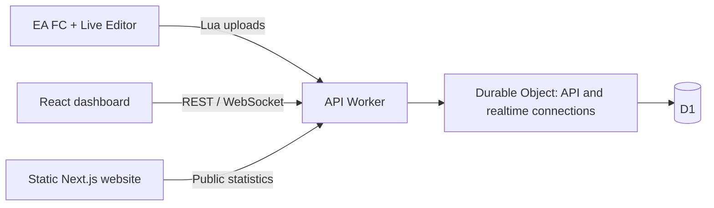

# Development

[Documentation](README.md) · [Player guide](USER_GUIDE.md) · [Database](DATABASE.md)

## Setup

Use Node.js **24.21.0 LTS** and pnpm **10.5.0**. The four package manifests,
`.nvmrc` files, and `.npmrc` enforce the supported Node and pnpm versions.
No MySQL, Docker, Cloudflare login, or email service is needed for local development.

```sh
nvm install
nvm use
corepack enable
pnpm install --frozen-lockfile
cp apps/backend/.dev.vars.example apps/backend/.dev.vars
pnpm db:migrate
pnpm dev
```

| Application | Local address |
| --- | --- |
| Dashboard | http://localhost:3000 |
| Website | http://localhost:3002 |
| API health check | http://localhost:8888/api/health_check |
| WebSocket | ws://localhost:8888/ws |

Wrangler stores local D1 and Durable Object state in `apps/backend/.wrangler`.
It is separate from the deployed database. Register with an email and password. Sign in with email and password;
email verification is disabled.

## Environment configuration

The backend reads ignored `apps/backend/.dev.vars` locally:

| Setting | Purpose |
| --- | --- |
| `SECRET_JWT` | Token signing secret, at least 32 characters; use a random value in production |
| `ALLOWED_ORIGINS` | Comma-separated dashboard and website origins |

D1 and Durable Object bindings are in `apps/backend/wrangler.jsonc`. Production
secrets are set through Wrangler, not a committed file. The legacy `.env.example`
applies only to the optional Node/MySQL backend.

The apps include `.env.development` and `.env.production`. Override public values
in `.env.development.local` or `.env.production.local` for another host:

| Application | Public settings |
| --- | --- |
| Dashboard | `VITE_APP_BACKEND_URL`, `VITE_POST_PLAYER_URL`, `VITE_WS_URL` |
| Website | `NEXT_PUBLIC_BACKEND_URL` |

API and upload URLs omit `/api`; WebSocket URLs include `/ws`. These variables
are public browser settings and must never contain database credentials or secrets.

## Commands

| Command | Result |
| --- | --- |
| `pnpm dev` | Runs all three applications |
| `pnpm dev:frontend` / `pnpm dev:website` / `pnpm dev:backend` | Runs one application |
| `pnpm db:migrate` | Applies pending local D1 migrations |
| `pnpm db:info` | Lists pending local D1 migrations |
| `pnpm build` | Builds both static sites and bundles the API without deploying |
| `pnpm start:website` | Previews the built static website on port 3002 |
| `pnpm start:backend` | Runs the local Worker on port 8888 |
| `pnpm --filter @fc-career-top/backend test:integration` | Tests the running local API and WebSocket |

The integration test creates test accounts and data. Run it against a disposable
local database. It covers registration, email login, 200-player uploads, growth history,
notifications, WebSocket delivery, key rotation, and account/game isolation.

## Architecture



The Durable Object serializes snapshot updates, performs password hashing within
its CPU allowance, and owns realtime connections. WebSocket hibernation handles
heartbeat replies without keeping the object active. D1 stores account and game data.
See the [application guides](README.md#application-guides) for source layouts.

## Game and backend on different computers

Set `VITE_POST_PLAYER_URL` to an address reachable from the Windows game PC.
For local network development, expose Wrangler on the network interface and use
`pnpm --filter @fc-career-top/frontend dev-expose`. Set the browser REST/WebSocket
URLs and `ALLOWED_ORIGINS` accordingly. Restart the apps and copy a new Lua script.
The website's Go to App link currently points to `https://app.fccareer.top`.

## Contributing

Use the root pnpm lockfile, add a new [D1 migration](DATABASE.md) for schema changes,
and run checks relevant to the affected app. Keep credentials out of commits.
The API build is a Wrangler dry run; frontend and website builds include TypeScript
checks. Report reproducible steps and the app/game version, with personal keys removed.
