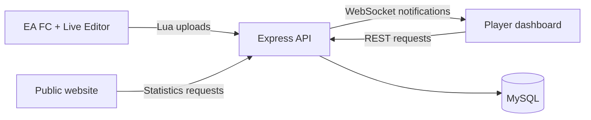

# Development

[Documentation](README.md) · [Player guide](USER_GUIDE.md) · [Database](DATABASE.md)

## Prerequisites

| Tool | Version / purpose |
| --- | --- |
| Node.js | 22.13.1, as pinned in `.nvmrc` |
| pnpm | 10.5.0, as pinned in `package.json` |
| MySQL | 8.4 for the backend database |
| Docker | Runs the pinned Flyway CLI during migrations |
| Resend | Sends account verification emails |

The game and Live Editor run on Windows. The services can be developed separately
from the game machine; their connection settings must match the network you use.

## Install

```sh
git clone https://github.com/VeejaLiu/FC-Career-Top.git
cd FC-Career-Top
# With nvm on macOS/Linux, select the repository's Node version:
nvm use
corepack enable
pnpm install --frozen-lockfile
cp apps/backend/.env.example apps/backend/.env
```

Install dependencies from the repository root. Workspace commands run each app
with its own application directory as the working directory.

## Environment configuration

### Backend

Use [apps/backend/.env.example](../apps/backend/.env.example) as the template for
`apps/backend/.env`. The template also includes the required app and logging settings.

| Setting | Purpose |
| --- | --- |
| `MYSQL_HOST`, `MYSQL_PORT`, `MYSQL_DATABASE` | MySQL host, port, and database name |
| `MYSQL_USERNAME`, `MYSQL_PASSWORD` | Database connection credentials |
| `SECRET_JWT` | A long random secret used for signed tokens |
| `APP_PORT` | HTTP and WebSocket port; defaults to 8888 in the template |
| `APP_BACKEND_URL` | API base used in email verification links; local value is `http://localhost:8888/api` |
| `RESEND_API_KEY` | Resend account API key |
| `MONITOR_ENABLED`, `MONITOR_USERNAME`, `MONITOR_PASSWORD` | Optional backend monitor; disabled in the template |

For email delivery, configure a verified sender domain in Resend and use a matching
`from` address in [send-email.ts](../apps/backend/src/lib/resend/send-email.ts).
The current source uses `no-reply@fccareer.top` in its email functions. A self-hosted
installation using another domain must update those sender addresses and the
verification-link base URL. See [Resend's Node.js guide](https://resend.com/docs/send-with-nodejs).

### Dashboard and website

Development URLs are already provided in each app's `.env.development`. Override
them in `.env.development.local` when using different hosts or ports.

| Application | Public settings |
| --- | --- |
| Dashboard | `VITE_APP_BACKEND_URL` for REST requests; `VITE_POST_PLAYER_URL` for Lua uploads; `VITE_WS_URL` for notifications |
| Website | `NEXT_PUBLIC_BACKEND_URL` for public statistics; `NEXT_PUBLIC_SITE_URL` for its public site configuration |

API and upload base URLs omit `/api`; application code appends the route prefix.
All `VITE_*` and `NEXT_PUBLIC_*` values are visible to browsers. Backend credentials
belong in its ignored environment file.

## Initialize and start

Create the empty database and run [Flyway migrations](DATABASE.md). Then:

```sh
pnpm db:migrate
pnpm dev
```

| Command | Result |
| --- | --- |
| `pnpm dev` | Runs all three applications |
| `pnpm dev:frontend` | Dashboard at http://localhost:3000 |
| `pnpm dev:website` | Website at http://localhost:3002 |
| `pnpm dev:backend` | API at http://localhost:8888/api; WebSocket at ws://localhost:8888 |
| `pnpm db:info` | Shows database migration state |
| `pnpm db:validate` | Verifies applied migrations |

Check `http://localhost:8888/api/health_check`; the expected response is `ok`.
Open the dashboard directly at port 3000. The website's current **Go to App** link
uses the planned `app.fccareer.top` address.

## Game and backend on different computers

Set `VITE_POST_PLAYER_URL` to the backend address reachable from the Windows game PC,
for example `http://192.168.1.10:8888` for a backend on your local network. Set the
REST and WebSocket URLs for the computers running the browser as well. Restart the
frontend after changing environment files, then copy a new script from Get Started.

To access the development dashboard from another computer, use its existing expose command:

```sh
pnpm --filter @fc-career-top/frontend dev-expose
```

For migrations, the MySQL server must also be reachable from the Flyway Docker
container. Connection overrides are covered in the [database guide](DATABASE.md).

## Architecture



See the [application guides](README.md#application-guides) for each app's source layout.
React 18 in the dashboard and React 19 in the website keep their own dependencies
inside the shared pnpm workspace.

## Build and checks

```sh
pnpm build
pnpm typecheck
```

Building the website generates its Next.js type files. Per-app build commands are
`pnpm build:frontend`, `pnpm build:website`, and `pnpm build:backend`.
The [deployment guide](DEPLOYMENT.md) lists their outputs and start commands.

## Contributing

Use the root pnpm lockfile for dependency changes. Add a new Flyway version for
schema changes, update the affected model, and run checks relevant to the changed
application. Keep environment credentials out of commits.

For bug reports, include reproducible steps, the affected app/game version, and
relevant logs or screenshots with personal API keys removed.
